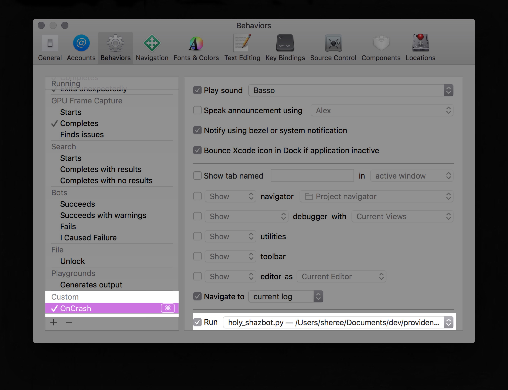
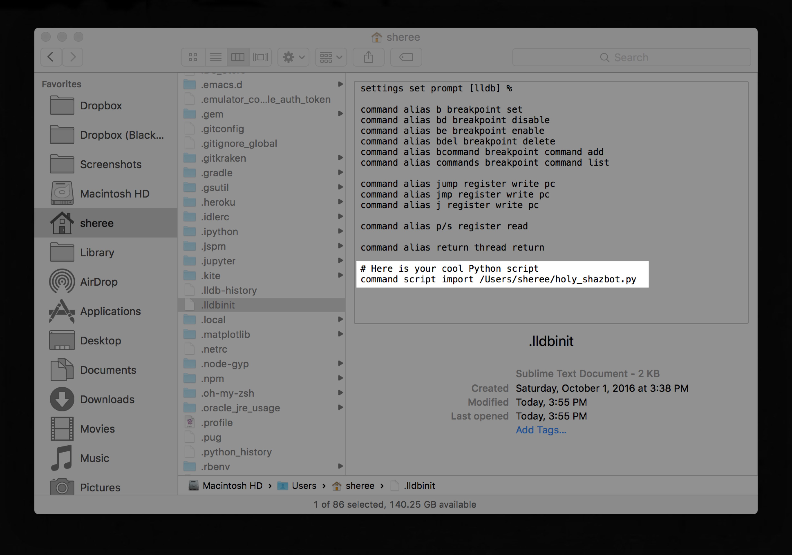
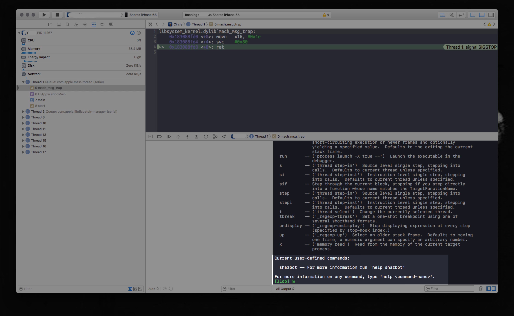

# [fit] SSSSSNAKES 

In Xcode and your Low Level Debugger 
🐍

^ TL,DR: this exists

---

# Hi, my name is Sheree and

###[fit] I work in Xcode all day long

^ Most of my recent work experience is testing for Objective-C Mac apps and Swift iOS apps.    
^ That means I'm in the Xcode IDE all day long. I'm a tester so, I look at a massive amount of console logs,  backtraces, and just general debugger output   
^ None of this makes any sense if you're not using Xcode. The cool thing is: 

---

# Xcode is free and so are you 

^ it has tons of cool tools like Instruments, iOS Simulator and Swift playgrounds
^ in order to do this, you would need to:

---

# [fit] Have an app
Or just grab one off of GitHub to play with. 
# ⌘B, ⌘R

^ be running your iPhone or tvOS or whatever app via Xcode, 
^ and if you're like me, do funny stuff to it to make your developers cry, your designers question their career path and generally just tell them their baby is not only ugly, it is also broken. 
^ once you're in Xcode making apps, you will eventually run in to:

---

# [fit] LLDB
low level debugger

^ the debugger. we haven't quite gotten this far yet in class 
^ but soon you will all be robust and learned wise senior python developers who spend a lot of time debugging and running PDB and doing traces etc etc etc 
^ for Xcode, you can use LLDB by setting...

---

# [fit] BREAKPOINTS
## Set them. They can be... conditional! 
Or just wait for your app to crash
*alternately, have me crash it for you, it's my core competency*

^ in Xcode you can have symbolic and conditional breakpoints, pretty cool stuff
^ in order to access LLDB you can set a breakpoint or pause your app or you know, just let nature take it's course and wait for a crash
^ once you're there: 

---

`(lldb) bt all`   
`(lldb) print foo`   
`(lldb) expression bar = 42`   
`(lldb) po baz.count` 
 
*&c*

^ you can do a bunch of cool stuff to debug and inspect your app.  
^ I know what you're thinking:

---

### *ok, cool. but... what does this have to do with Python??*

^ well.. I'm so glad you asked! 

--- 

# [fit] you can
run a Python script after hitting your inevitable crashers

^ run a script!

--- 

# [fit] you can
use python to programmatically interact with LLDB 

^ import LLDB into Python and interact that way
^ but most importantly: 

--- 

# [fit] you can
do it. I believe in you.

---

#right, so...

#[fit] 🐍

^ I honestly haven't gotten too deep into this stuff yet but let me give you the high level overview

--- 

^ this is the most basic example of how to add Python to your development and debugging flow in Xcode. 
^ you can simply add it as an action on an event 
^ in this context, you aren't interacting with LLDB 
^ what can you do in that script? well: 

---

* Take a screenshot, collect a backtrace, slap it into JIRA
* Have the system play a fail horn sound
* Tweet about hating Xcode
* Slackbot it

^ you can literally do whatever you want. you're only limited by your imagination, coding skills and or your ability to steal stuff off of stack overflow 
^ I don't know, these are pretty simple things but I'm sure you're much more clever than all that

--- 

## and if you're really brave...

--- 

...and you know how your code works, are familiar with lldb commands, and fluent in python, know what you're trying to achieve, willing to put in the effort, have time to be reading the docs, have the patience to understand them, have time for trial and error, and... 

^ this is where you'd go much much deeper into having Python and LLDB interacting. 
^ it's pretty fucking complicated honestly

--- 

^ this is an init file for lldb in your homedir
^ when Xcode launches, it's part of your LLDB environment
^ you can add your scripts here and call them an alias and then use them, just like an LLDB command
^ lldb will even show you your docstrings from your script in the help menu! fancy!

---

^ this is Xcode and I have an app running in the debugger, it is paused and I typed LLDB help command
^ and would you look at that, there's my script! it worked! 

---

# smell ya later
# [fit] ✌️

^ thank you that's all i have. hopefully this was new novel to you. and if you have dreams of being an iOS developer, the goldrush is over but your python skills won't go to waste. 

--- 
*On the off chance this is interesting to you:*

`(lldb) help`

- http://lldb.llvm.org/python-reference.html

